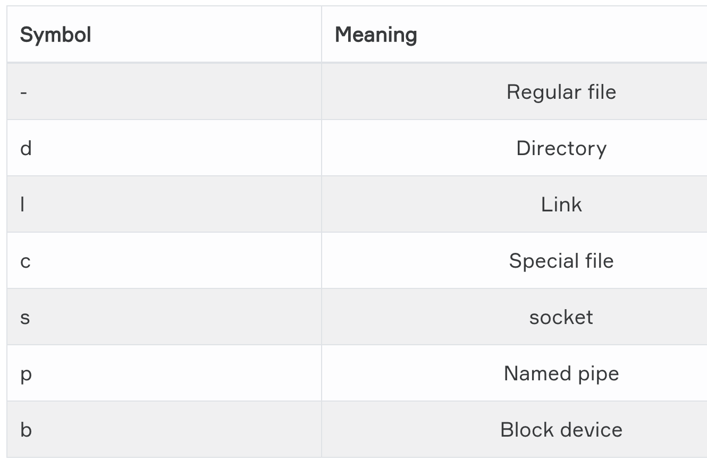
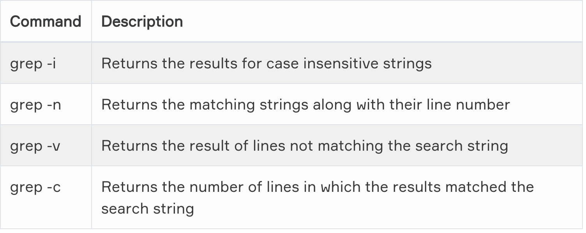
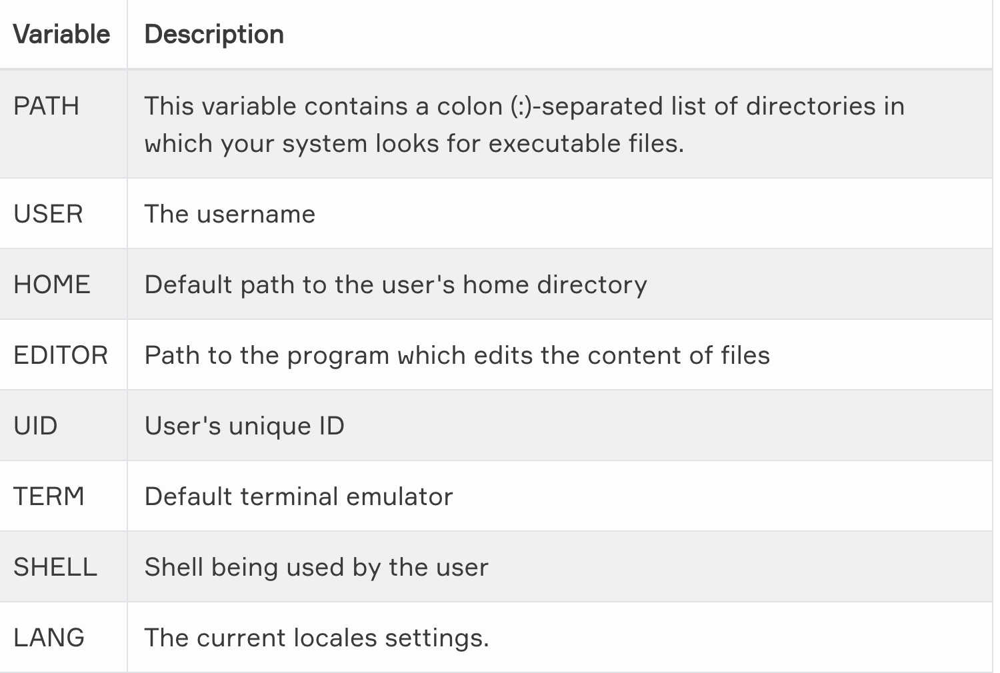
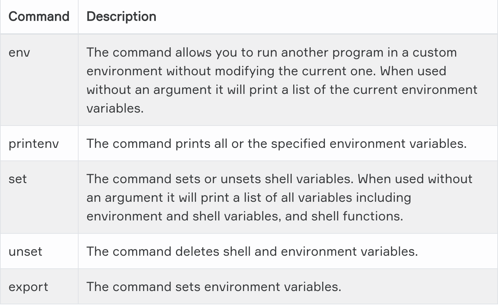
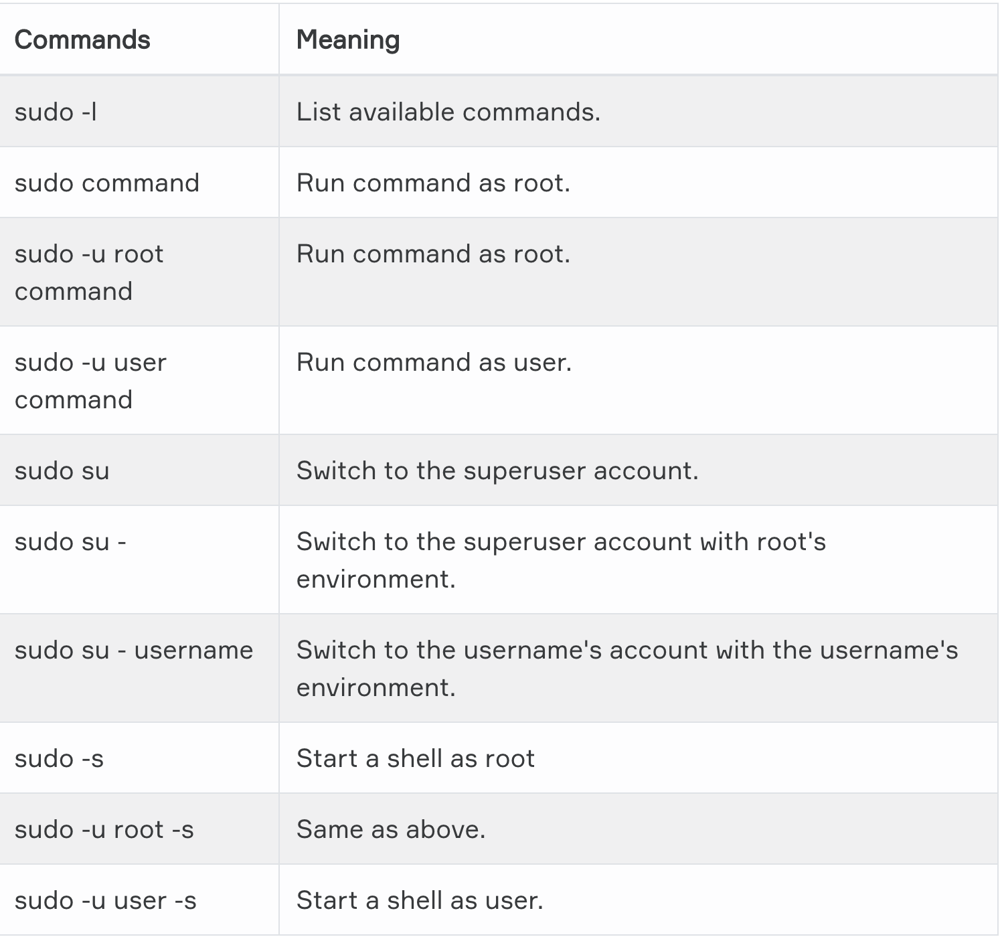

# Linux

```
man ls
The documentation for ls will be displayed on your screen
```
`What does man do?`
- displays the manual page from system's documentation

`What does the whatis command do?`
- Displays brief description of a command 

`Which command used to search for a keyword in manpages?`
- apropos

# Working with File Contents


```
ls -al
Gives more detailed information of files.

head
Display first 10 lines

tail
Display last 10 lines

cat
Display a file

cat > test.txt
Create a file

cat test.txt > test1.txt
Copy file

tac
cat backward

more test
View the contents of text file

less test
It shows less filen tha more command

find
Search for files

find .
Search in current directory

find /home -name fil\*
If you want to find all files start with "fil" in the home directory
```

`Grep`

- It used for search text or words

```
grep 'Ali' text.txt
```
``
Tips= The Major difference is FIND is for searching files and directories using filters while GREP is for searching a pattern inside a file or searching process(es).
``


# User Environment

- The environment variables are managed by the shell.

- ``A list of all specified environment variables can be viewed entering the printenv command``.





- ``Variables are case-sensitive and usually they are created in upper case.``

- ``You can create your own user-defined variable, with the syntax: VARIABLE_NAME= variable_value``

## PATH
- PATH is displayed with the echo command
``` echo $PATH```

# Users and Groups

- The sudo `(superuser do)` command gives some admin privileges to non-admin users

- ``If you're not sure if you're using sudo or su, look at the trailing character on the command line. If it's a pound sign (#), you're logged in as root. ``



## Basic User Commands

```
whoami 
Gives you username
- 
who
Provide you details about who is logged on
-
id
Provide you user id
-
su ali
Enables a shell to be run
-
su - ali
Followed by the target username
```
## User management

```
useradd -m -d /home/ali -c "ali ustunkol"
-m = forcing creation of home directory
-d = setting the name of home directory
-c = setting a description
-
adduser ali
More effective at creating new user
-
userdel -r ali
-r = remove from home directory
- 
usermod
Modeify user's properties
-
passwd Ali
Set the user password
-
shadow file
User password encrypted and save /etc/shadow
-
 /etc/login.defs
 Includes some default user password settings
-
groupadd devops
Create a new group
-
groups
Display a list of groups
-
groupdel
Delete a group
-
gpasswd -a ali devops
Add Ali to devops group
-
gpasswd -d ali devops
Remove ali from devops group
```
# Package Management

## Package formats

### RPM packages
- RPM, the RedHat Package Manager, is a powerful package manager that you can use to install, update and remove packages.

### DEB (.deb) packages: 
- This package format is the default on Debian GNU/Linux, where dselect, and, nowadays more common, aptitude, is the standard tool for managing the packages.

### Source packages: 
- The largest part of Linux programs is Free/Open Source, so source packages are available for these programs.

``` Quiz```
- ``Which is NOT a valid binary software package format in Linux?``
    - .exe 