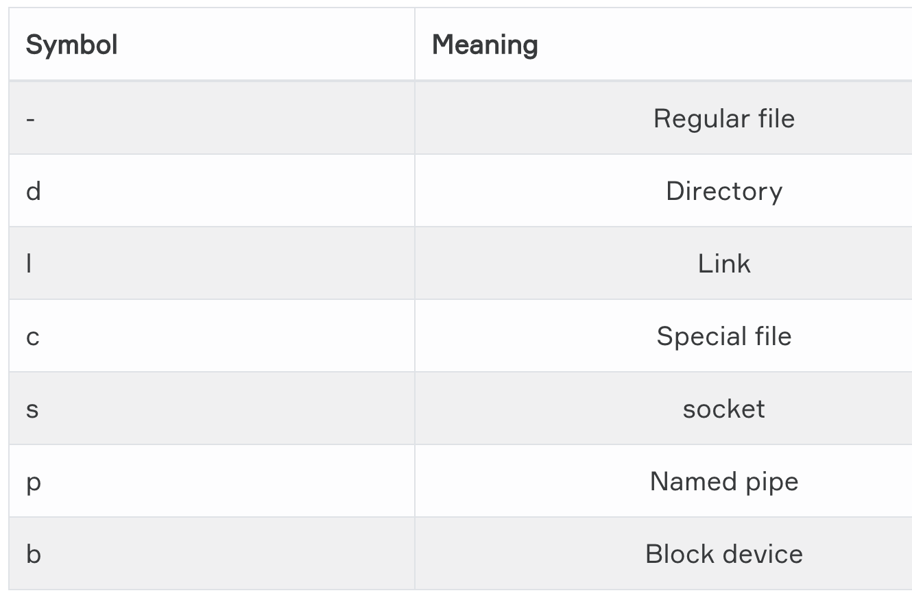
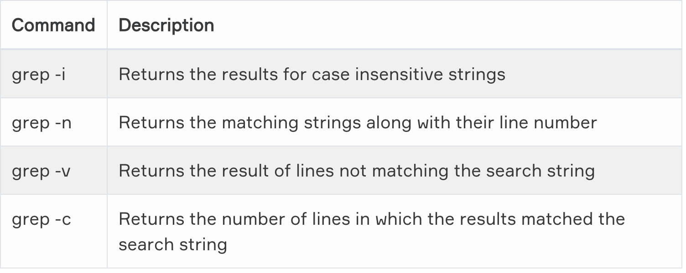
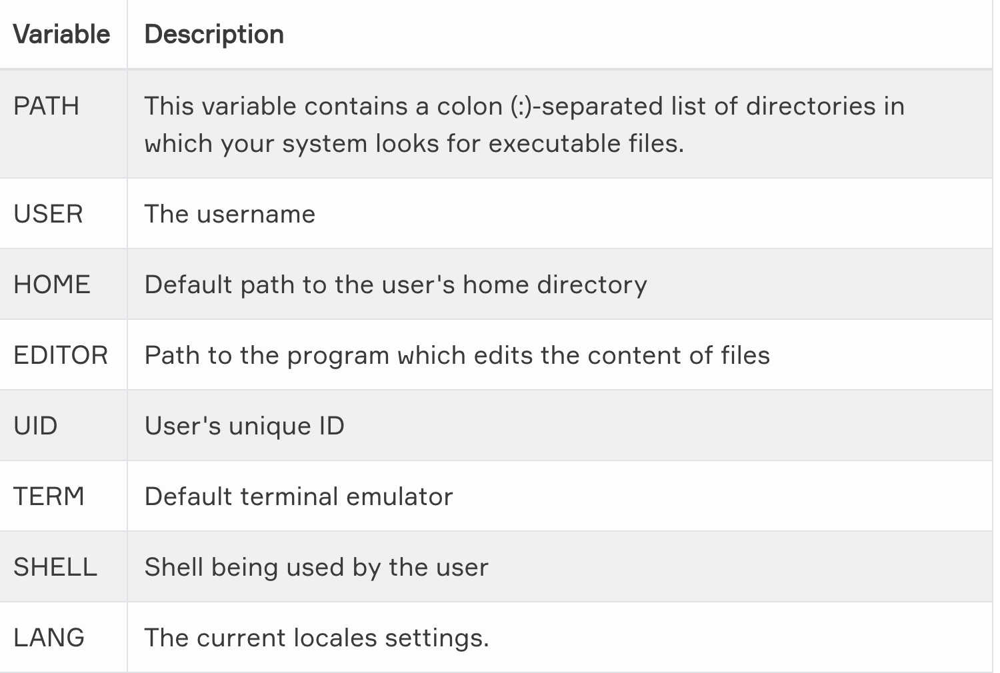
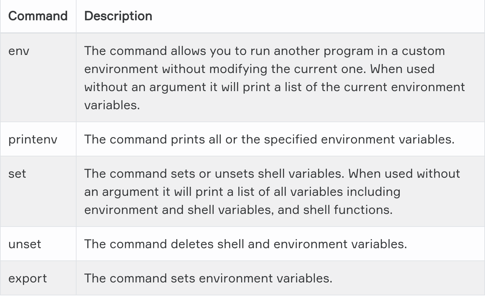
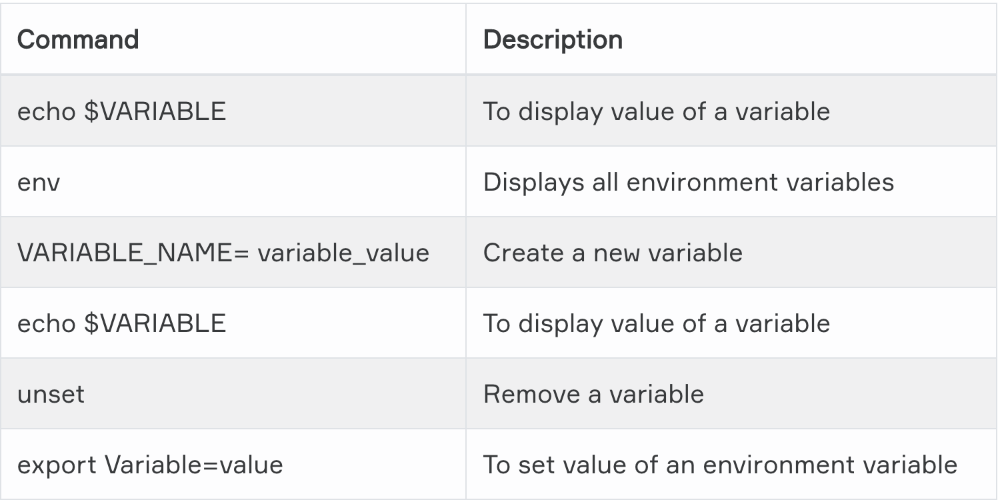
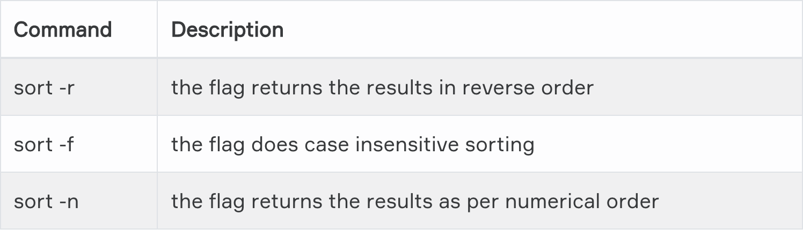
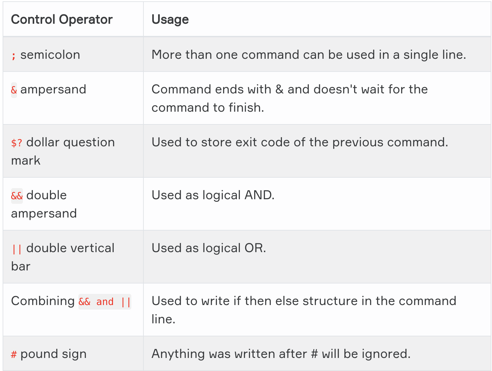
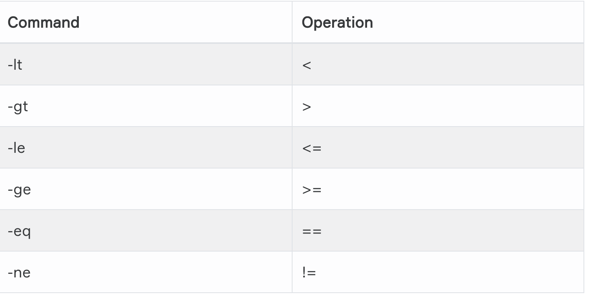

# Linux Essentials

```
- man ls
- The documentation for ls will be displayed on your screen
```

# Info Pages
```
- info ls
- Read the info pages about the command
```

`What does man do?`
- displays the manual page from system's documentation

`What does the whatis command do?`
```
- whatis ls
- Displays brief description of a command 
```

`Which command used to search for a keyword in manpages?`
- apropos
```
- apropos find
- Display all manual entries with the word find
```
# Help option
```
- ls --help
- help ls
- Which gives a short explanation about how to use the command
```

# Working with File Contents


```
ls -al
Gives more detailed information of files.

head
Display first 10 lines

tail
Display last 10 lines

cat
Display a file

cat > test.txt
Create a file

cat test.txt > test1.txt
Copy file

tac
cat backward

more test
View the contents of text file

less test
It shows less filen tha more command

find
Search for files

find .
Search in current directory

find /home -name fil\*
If you want to find all files start with "fil" in the home directory
```

`Grep`

- It used for search text or words

```
grep 'Ali' text.txt
```
``
Tips= The Major difference is FIND is for searching files and directories using filters while GREP is for searching a pattern inside a file or searching process(es).
``

- `history | grep echo`

# User Environment

- The environment variables are managed by the shell.

- ``A list of all specified environment variables can be viewed entering the printenv command``.





- ``Variables are case-sensitive and usually they are created in upper case.``

- ``You can create your own user-defined variable, with the syntax: VARIABLE_NAME= variable_value``



## PATH
- PATH is displayed with the echo command
``` echo $PATH```

# Users and Groups

- The sudo `(superuser do)` command gives some admin privileges to non-admin users

- ``If you're not sure if you're using sudo or su, look at the trailing character on the command line. If it's a pound sign (#), you're logged in as root. ``


## Basic User Commands

```
whoami 
Gives you username
- 
who
Provide you details about who is logged on
-
id
Provide you user id
-
su ali
Enables a shell to be run
-
su - ali
Followed by the target username
```
## User management

```
useradd -m -d /home/ali -c "ali ustunkol"
-m = forcing creation of home directory
-d = setting the name of home directory
-c = setting a description
-
adduser ali
More effective at creating new user
-
userdel -r ali
-r = remove from home directory
- 
usermod
Modify user's properties
-
passwd Ali
Set the user password
-
shadow file
User password encrypted and save /etc/shadow
-
 /etc/login.defs
 Includes some default user password settings
-
groupadd devops
Create a new group
-
groups
Display a list of groups
-
groupdel
Delete a group
-
gpasswd -a ali devops
Add Ali to devops group
-
gpasswd -d ali devops
Remove ali from devops group
```

`How do you add a user to the sudo group?`

- Log in to computer or server as the root user.
- Use the adduser command to add a new user to system. (#adduser username)
- Use the usermod command to add the user to the sudo group. (#usermod -aG sudo username)
- Test sudo access on new user account. (# su - username)

# Package Management

## Package formats

### RPM packages
- RPM, the RedHat Package Manager, is a powerful package manager that you can use to install, update and remove packages.

### DEB (.deb) packages: 
- This package format is the default on Debian GNU/Linux, where dselect, and, nowadays more common, aptitude, is the standard tool for managing the packages.

### Source packages: 
- The largest part of Linux programs is Free/Open Source, so source packages are available for these programs.

``` Quiz```
- ``Which is NOT a valid binary software package format in Linux?``
    - .exe 

## DPKG – Debian Package Management System

```
- dpkg –help # Listing all options
- apt update # Updating the list of packages known by your system
- apt install # Installing a package and all its dependencies
- apt remove #Removing a package
- apt purge # Removing a package and its configuration files from your system
```
## RPM (Red Hat Package Manager)
```
- yum install # Installing a package
- yum -y install # During installment, linux asks for confirmation. To skip confirmation you can use option -y
- yum remove # Removing a package with all dependencies.
- yum update # Updating a package
```

# Filters

`When you pipe two commands, the "filtered " output of the first command is given to the next.`

```
# cat
- Displays text of the file line by line

- tac test.txt | cat | cat | cat | cat
>>Five
>>Four
>>Three
>>Two
```
```
# tee
- tee is almost same as cat, but it has two identical outputs

- tac test.txt | tee test1.txt | tee
>>one
>>two
>>three

- cat test1.txt
>>three
>>two
>>one
```
```
# grep
- grep is to filter lines of text containing or not containing a certain strings.

- cat test.txt
>>Amelie Day
>>Williams Toni
>>Venus Bakery
>>Williams Alie

- cat test.txt | grep Williams
>>Williams Toni
>>Williams Alie
```
` Note = Why does the tee command used for? The tee filter is used to send an output to more than one destination.`

```
# cut
- The cut filter can select columns from files

- cut -d: -f1,3 /etc/passwd | tail -3
>>Williams Alie
>>Venus Bakery
>>Williams Toni
    - d means delimiter used with colon(:)
    - f means field
```
```
# tr
- convert lower case to upper case or reverse

- cat test.txt 
>>toni
>>king

- cat test.txt | tr [a-z] [A-Z]
>>TONI
>>KING
```
```
# wc
- counting words

- wc test.txt
14 test.txt
```
` Note= How do we count bytes with wc command? wc -c file_name`

```
# sort
-The sort filter default alphabetical sort.

-cat test.txt
>>Breal
>>Abba

-sort test.txt
>>Abba
>>Brel
```


```
# uniq
- Remove from duplicates from the list

-cat test.txt
>>Breal
>>Abba
>>Toni
>>Cesar
>>Toni

-sort test.txt | uniq
>>Abba
>>Brel
>>Cesar
>>Toni
```
# ` Control Operators`

- We put more than one command on the command line



```
# ; semicolon
- we can put one or more command separated with ;

- echo Hello ; echo World
>>Hello
>>World
```
```
# & ampersand
- If line ends with and &, the shell will not wait command to finish.

-sleep 20 &
>>...wait 20 seconds...
- We can write any other command
```
```
# $? is a shell parameter and not a variable, since you can't assign a value to $?

-touch file1
-echo $?
>>0

-rm file1
>>cannot remove...
>>1

- If status 0 commands was successfully executed. If shows 1 command was a failure.
```

```
# && double ampersand
- Logical AND. The second command is executed when the first one succeeds.

-echo first && echo second
>>first
>>second
```
```
# || double vertical bar
- Represents OR.The second command is executed when the first command is fails.

-zecho first || echo second ; echo third
>>second
>>third
```
```
# && and || combining 
- You can use this logical AND and logical OR to write an if-then-else structure on the command line. 

-rm file1 && echo It worked! || echo It failed!
>> It worked!

-rm file1 && echo It worked! || echo It failed!
>>No such a file 'file1'
>>It failed!
```
```
# \ escaping characters
- Use of characters

- echo escaping \\\ \#\ \&\ \"\ \'
>>escaping # & " '

- echo This command line \
>is split in two parts \
>>This command line is split in two parts
```
# `Shell Scripting`
- A shell is simply a macro processor that executes commands
- The Bash is one of the commonly used shell.
# Some Examples
```
- export PS1="[\t \j] "
Displays time of day and number of running jobs
- export PS1="[\d][\u@\h \w] : "
Displays date, user name, host name and current working directory. Note that \W displays only base names of the present working directory.
- export PS1="{!} "
Displays history number for each command.
- export PS1="[\033[1;35m]\u@\h[\033[0m] "
Displays user@host in pink.
- export PS1="[\033[7;34m]\u@\h \w [\033[0m] "
White characters on a blue background.
- export PS1="[\033[3;35m]\u@\h \w [\033[0m]\a"
Pink prompt in a lighter font that alerts you when your commands have finished.
```
## Shell Scripts
- scripts often begin with 
```
- #! /bin/bash
```

## Finding Bash

```
-find ./ name_of_your_bash
>>find the bash run this command from the root dir:

--Other locations check:
-ls −l /bin/bash  
-ls −l /sbin/bash  
-ls −l /usr/local/bin/bash  
-ls −l /usr/bin/bash  
-ls −l /usr/sbin/bash  
-ls −l /usr/local/sbin/bash
```
## Script File Execution

```
-#!/bin/bash
>>echo “Hello World”

--make a executable
-chmod +x hello world.sh
```
## Echo
- bash script example

```
#!/bin/bash
# declare STRING variable
STRING="Hello World"
#print variable on a screen
echo $STRING
```
```
-chmod +x hello_world.sh
-./hello_world.sh
>>Hello World
```


- Let's request user age

```
#! /bin/bash
clear
echo "Enter your age"
read  st1
echo "Your age: " $st1
```

```
- chmod +x your_age.sh
- ./your_age.sh

>>>Enter your age
30 (User will enter an age)
Your age: 30
```

## Variables
- There are no data types
- A variable in bash can contain a number, a character, a string of characters

```
- Writing "Jones" using variables

#!/bin/bash
NAME=”Jones”
echo $NAME
echo "$NAME"
echo "${NAME}!"
```
## String Quotes
- Single quotes (‘ ' ’) preserves the literal value of each character within the quotes.
- Double quotes (‘ " ’) preserves the literal value of all characters within the quotes, with the exception of ‘$’, ‘`’, ‘\’
```
NAME="John"
echo "Hi $NAME"  #=> Hi John
echo 'Hi $NAME'  #=> Hi $NAME
```

## Brace Expansion
- Brace expansion is a mechanism by which arbitrary strings may be generated.
```
echo {A,B}.js
{A,B}   Same as A B
{A,B}.js    Same as A.js B.js
{1..5}  Same as 1 2 3 4 5
```
## String Lists
- The brace expansion is only performed if the given string list is really a list of strings
```
$ echo {I,want,my,money,back}
I want my money back

$ echo _{I,want,my,money,back}
_I _want _my _money _back

$ echo {I,want,my,money,back}_
I_ want_ my_ money_ back_

$ echo _{I,want,my,money,back}-
_I- _want- _my- _money- _back-
```

## Numeric and String Comparisons
- Using bash shell comparisons, we can compare strings ( words, sentences ) or integer numbers whether raw or as variables. Note that [[ is actually a command/program that returns either 0 (true) or 1 (false).

```
[ 100 -eq 100 ]
echo $?   # 0
[ “GNU” = “UNIX” ]
echo $?  # 1
```


## File Conditions

```
[[ -e FILE ]]   Exists
[[ -r FILE ]]   Readable
[[ -d FILE ]]   Directory
[[ -w FILE ]]   Writable
```
## Conditionals
-  This decision is taken by evaluating an expression.

- if .. then example
```
#!/bin/bash
if [ "foo" = "foo" ]; then
  echo expression evaluated as true
fi
```
- if .. then .. else example
```
#! /bin/bash
clear
echo "enter a number"
read  st1
if  (( $st1 ==  5  ))
then
  echo "You entered five!"
fi
# -eq  -gt -lt -ge  -le -a -o
if [ $st1 -eq 5  ]
then
   echo equal to five
elif (( $st1 < 5 ))
then
   echo "less than five"
else
 echo "more than five"
fi
```

## Loops = for, while, until

## For
- The for loop is a little bit different from other programming languages. Basically, it lets you iterate over a series of ‘words’ within a string.
```
#!/bin/bash
for i in $( ls ); do
   echo item: $i
done

for service in S3 EC2 Lambda Glacier CloudFront Kinesis
do
  echo "Amazon Service: $service"
done
```
## While
-  The while executes a piece of code if the control expression is true, and only stops when it is false (or an explicit break is found within the executed code.
```
#!/bin/bash 
     COUNTER=0
     while [  $COUNTER -lt 10 ]; do
         echo The counter is $COUNTER
         let COUNTER=COUNTER+1 
     done     
```
## Until
- The until the loop is almost equal to the while loop, except that the code is executed while the control expression evaluates to false.
```
     #!/bin/bash 
     COUNTER=20
     until [  $COUNTER -lt 10 ]; do
         echo COUNTER $COUNTER
         let COUNTER-=1
     done
```

## Functions
- Declaring a function is just a matter of writing function my_func { my_code }
- Calling a function is just like calling another program, you just write its name

```
#!/bin/bash

function quit {
   exit
}

function hello {
   echo Hello!
}

 hello
 quit

 echo foo 
 ```

 ## Case
 - Each case statement starts with the case keyword followed by the case expression and the in keyword
 - The statement ends with the esac keyword
 - Use multiple patterns separated by the | operator
 - The ) operator terminates a pattern list

 ```
 case EXPRESSION in

  PATTERN_1)
    STATEMENTS
    ;;

  PATTERN_2)
    STATEMENTS
    ;;

  PATTERN_N)
    STATEMENTS
    ;;

  *)
    STATEMENTS
    ;;
esac
```
## Case and Function
```
#!/bin/bash
inputs(){
     read -p "Enter first integer: " int1
    read -p "Enter second integer: " int2
}

exitPrompt(){
    read -p "Do you wish to continue? [y]es or [n]o: " ans
    if (( $ans == "n"))
    then
        echo "Exiting the script. Have a nice day!"
        sleep 2
        exit
    else
        continue
    fi
}


while(true)
    do
    clear
    printf "Choose from the following operations: \n"
    printf "[a]Addition\n[b]Subtraction\n[c]Multiplication\n[d]Division\n"
    printf "################################\n"
    read -p "Your choice: " choice

    case $choice in
    [aA])
        inputs
        res=$((int1+int2))
    ;;

    [bB])
        inputs
        res=$((int1-int2))
    ;;

    [cC])
        inputs
        res=$((int1*int2))
    ;;

    [dD])
        inputs
        res=$((int1/int2))
    ;;

    *)
        res=0
        echo "wrong choice!"
    esac

    echo "The result is: " $res
    exitPrompt
done
```